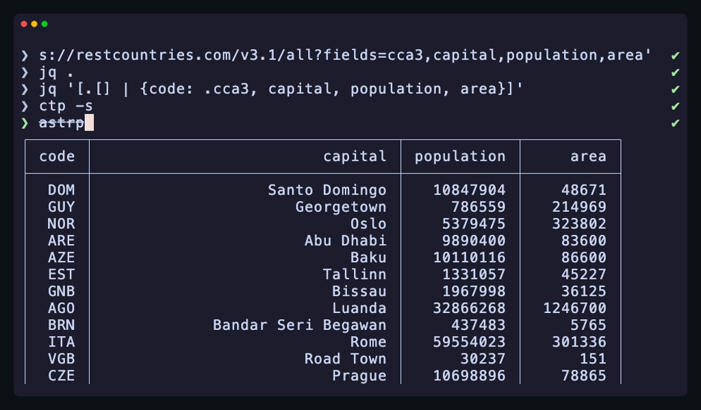

# Pipec

Pipec is an application designed to edit command pipelines.

## Purpose

I often need to execute complex pipelines: query some API, extract information using *jq*, execute some commands based on it:

```sh
curl -s https://some.api/fetch?limit=100 | jq -r '.result.items[] | .host.fqdn' | xargs -n1 -I% -- ssh '%' grep ERROR /var/log/service.log
```

Editing such pipelines directly in shell has some inconveniences:
* It is hard to navigate between commands when command line becomes too long;
* Each stage of pipeline is executed every time, even when it isn't changed. This is especially ыad when some stage takes a long time to run;
* It is hard to preview output of any internal stage.

Pipec tries to solve these issues. Of course, there are drawbacks too:
* It's not your fine-tuned shell or editor, shortcuts are conventional emacs-style, but may be restrictive;
* Output currently can't be scrolled, but this will be fixed.

## Usage



### Basics

Just running `pipec` will open empty pipeline.

Basic help with hotkeys and legend is shown on start, so there shouldn't be any problem to start using *pipec*.

Type command and press **Enter** to execute. Use **Ctrl-Q** to exit.

**Warning**: All output of each stage is saved into memory. Don't use it with commands which produces a lot of output.

### Focused and shown stages

Stage you are editing is *focused* one. You may change focused stage with *↑*/*↓* keys.

However, it is often convenient to preview output of some earlier stage when composing current one. So there is concept of *shown* stage. You select stage to show using **Ctrl-Enter** key.

### Pipeline Execution

When you press **Enter**, whole pipeline is executed. However, several leading stages may not be restarted, but already running/finished stage may be reused.

Stage may be reused if:
* It is first one or stages above it are also reused;
* Command wasn't changed since last execution;
* It is still running or was finished successfully.

### Starting with existing pipeline

*Pipec* accepts any number of positional arguments. Each argument is turned into separate stage command:

```sh
pipec 'ls -l' 'grep .toml'
```

If you don't want to split pipeline into commands manually, use may use `--parse-commands` option to split passed pipelines into commands:

```sh
pipec --parse-commands 'ls -l | grep .toml'
```

You may put following to you *~/.zshrc* to edit currently typed command with *pipec* by pressing **Ctrl-X P**:

```sh
edit-pipeline-widget() {
  local OUTPUT=$(cd ~/path/to/pipec; cargo run -- --parse-commands --print-command -- "$BUFFER")
  if [ $? -eq 0 ]; then
    BUFFER="$OUTPUT"
  fi
}
zle -N edit-pipeline-widget
bindkey '^xp' edit-pipeline-widget
```

If you know how to implement that for other shells beside *zsh*, tell me.

## Output mode

By default, *pipec* doesn't print anything on exit. However, you may use `--print-command` option to get final pipeline command printed to stdout on exit.
